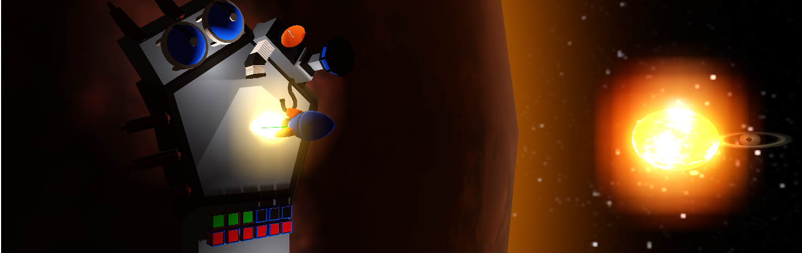

# Hanseatic Galaxy

    

A space trading game set in our solar System. It features realistic n-body orbital mechanics for the player ship. Fuel is a essential concern.

This game was made using the Godot Game Engine (https://godotengine.org) which is distrebuted unter the following Licence (https://godotengine.org/license).

 
